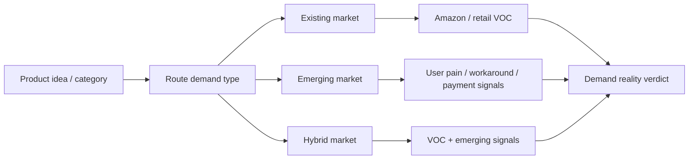
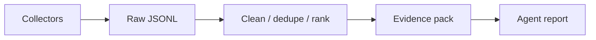

# Vibe Product Demand Research

> A portable research template for validating whether a product demand is real.

`Vibe Product Demand Research` is a lightweight skill/agent template that helps an AI research assistant judge whether a product idea is backed by real user behavior, not just hype.

It can be used in Codex, Claude Code, OpenCode, CodeX, or any agent system that can read Markdown instructions.

<p>
  
  
  
  
</p>

## What It Does



The template routes a product idea into one of three research paths:

| Path | Use when | Evidence focus |
|---|---|---|
| Existing market | Mature category with products and reviews | Amazon, retail reviews, competitor VOC, good/bad review themes |
| Emerging market | New product, new category, or weak retail evidence | User complaints, workarounds, search behavior, crowdfunding, paid tools |
| Hybrid market | Products exist, but the proposed behavior/use case is new | Existing-product VOC plus early demand signals |

## Repository Structure

```text
skills/
  vibe-product-demand-research/   # Codex-compatible router skill
  amazon-voc-research/            # Existing-market VOC skill
  emerging-demand-research/       # New-market demand validation skill
  method-two-crawler-pipeline/     # Lower-cost crawler + evidence-pack pipeline

templates/
  codex/                          # Project-level Codex instruction template
  claude-code/                    # CLAUDE.md template
  opencode/                       # AGENTS.md template
  generic-agent/                  # Portable Markdown agent instructions
```

## Quick Start

Clone the repository:

```bash
git clone https://github.com/wangbh030722/Vibe-product-demand-research.git
cd Vibe-product-demand-research
```

### Use as Codex Skills

Copy the full skill pack:

```bash
cp -R skills/* ~/.codex/skills/
```

Then restart Codex and invoke:

```text
$vibe-product-demand-research Research whether this product demand is real: <product idea>
```

### Use with Claude Code

Copy the Claude Code template into your project:

```bash
cp templates/claude-code/CLAUDE.md ./CLAUDE.md
```

Then ask Claude Code:

```text
Use the demand research template in CLAUDE.md to evaluate this product idea: <product idea>
```

### Use with OpenCode / CodeX / Other Agents

Copy the generic or AGENTS template into your project:

```bash
cp templates/opencode/AGENTS.md ./AGENTS.md
```

or:

```bash
cp templates/generic-agent/PRODUCT_DEMAND_RESEARCH.md ./PRODUCT_DEMAND_RESEARCH.md
```

Then tell your agent to follow that file when researching product demand.

## Output Principles

- Use real evidence, not vibes.
- Include source links wherever possible.
- Quote short user voices with Chinese translation when useful.
- Do not invent reviews, counts, trends, market size, or payment signals.
- Do not use vague labels like `high`, `medium`, `low`, or `strong demand`.
- If evidence is missing, say so directly.
- End with a factual demand verdict and evidence boundary.

## Method Two: Crawler Pipeline

When paid Amazon/VOC APIs are too expensive, use the cheaper method-two pipeline:



This path keeps Amazon reviews optional instead of making them the bottleneck.

| Source | V1 role |
|---|---|
| Reddit | User complaints, workarounds, raw language |
| YouTube comments | Product experience and creator-audience feedback |
| Product Hunt | Early product feedback |
| Kickstarter / Indiegogo | Preorder, backer, and payment signals |
| App Store / Chrome Web Store | Software and companion-app reviews |
| Google/search/SEO | Discovery and problem phrases |
| Amazon search/product pages | Lightweight competitor and ASIN discovery |
| Amazon reviews | Optional manual import or later paid source |

Use the Codex skill:

```text
$method-two-crawler-pipeline Plan a low-cost crawler and evidence-pack workflow for this product idea: <product idea>
```

## Example Verdicts

```text
Demand is supported by repeated user complaints and workaround behavior.
Payment evidence was not collected.
```

```text
Demand is supported by existing retail reviews, but the new use case requires separate validation.
```

```text
Current evidence is mostly media attention; user pain evidence is thin.
```

## License

MIT
